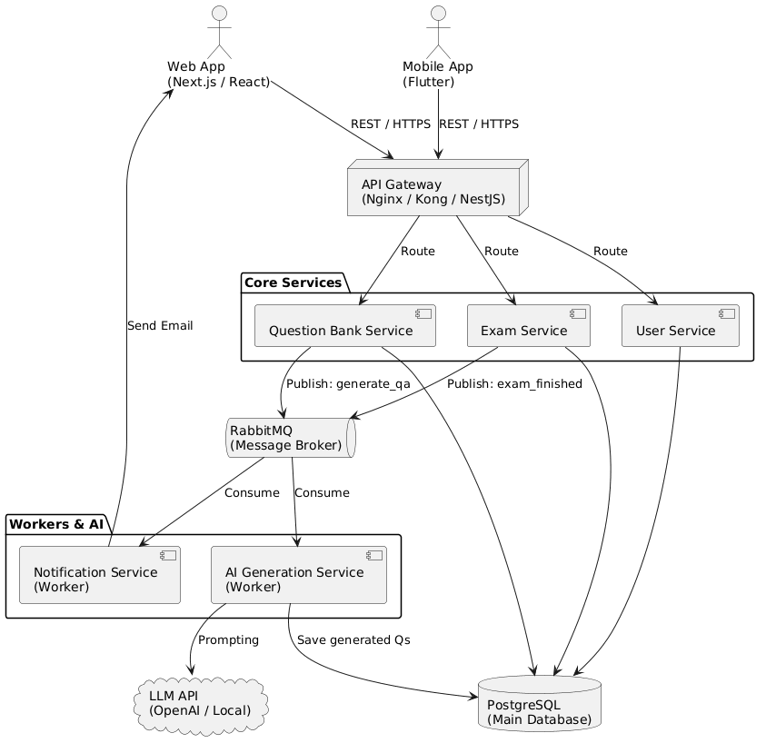
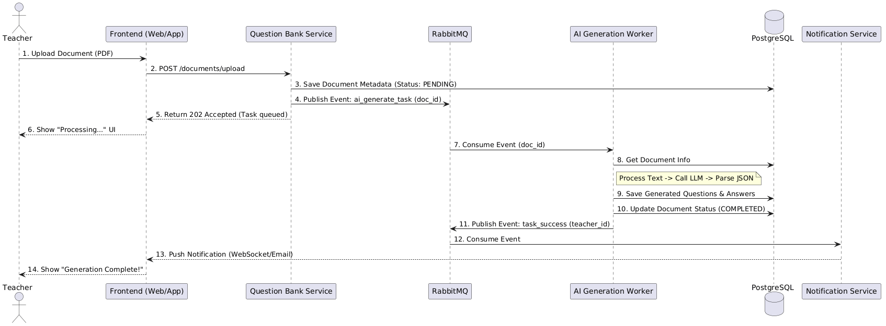
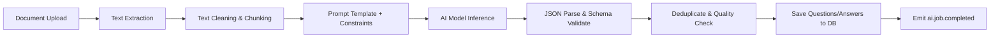
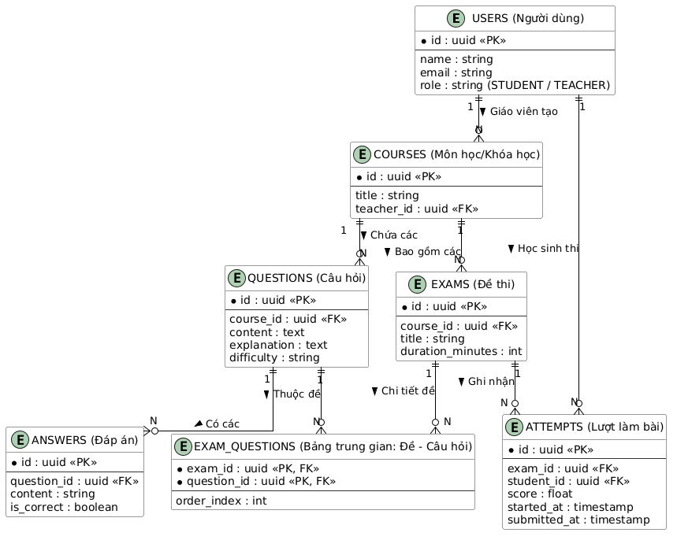
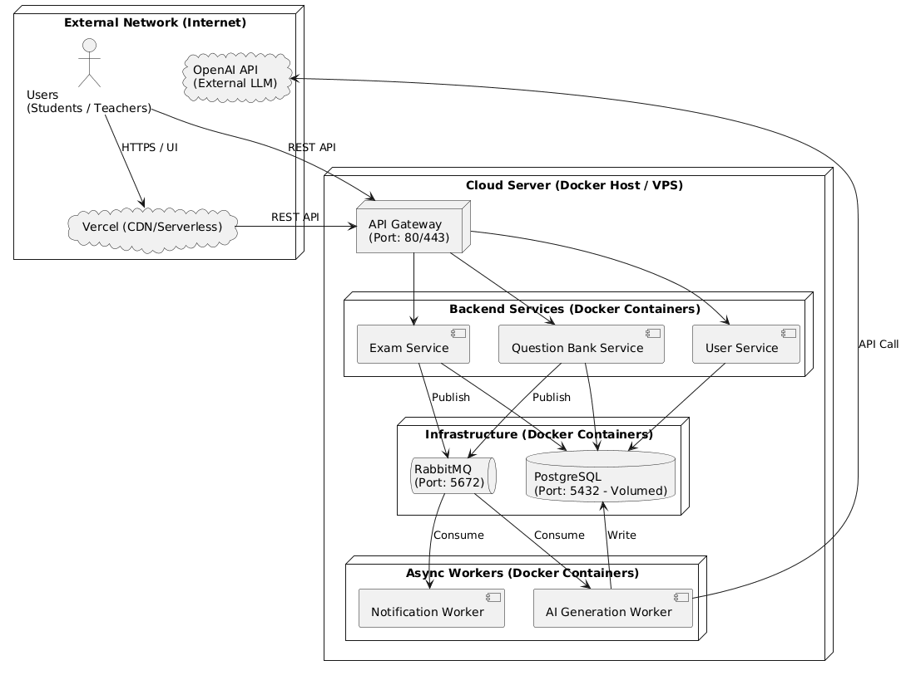

# Architecture Document

## Hệ thống quản lý ngân hàng câu hỏi trắc nghiệm & thi thử THPT tích hợp AI

> **Đề tài**: Xây dựng hệ thống quản lý ngân hàng câu hỏi trắc nghiệm và tổ chức thi thử trực tuyến cho học sinh THPT, tích hợp AI tự động sinh câu hỏi.

---

## Mục lục

- [1. System Overview](#1-system-overview)
- [2. Technology Stack](#2-technology-stack)
- [3. System Architecture](#3-system-architecture)
- [4. Microservice Architecture](#4-microservice-architecture)
- [5. RabbitMQ Message Flow](#5-rabbitmq-message-flow)
- [6. AI Question Generation Pipeline](#6-ai-question-generation-pipeline)
- [7. Database Architecture](#7-database-architecture)
- [8. Deployment Architecture](#8-deployment-architecture)

---

## 1. System Overview

### 1.1 Mô tả tổng quan hệ thống

Hệ thống là nền tảng giáo dục trực tuyến phục vụ 3 nhóm người dùng chính: **Học sinh**, **Giáo viên**, **Quản trị viên**. Trọng tâm là:

- Quản lý ngân hàng câu hỏi trắc nghiệm theo môn/chủ đề/mức độ khó.
- Tổ chức thi thử trực tuyến cho học sinh THPT với chấm điểm tự động.
- Tích hợp AI để tự động sinh câu hỏi từ tài liệu giáo viên tải lên.

Kiến trúc sử dụng mô hình **Microservices + Event-Driven** với RabbitMQ để tách luồng đồng bộ (API) và bất đồng bộ (AI/notification), giúp hệ thống phản hồi nhanh và dễ mở rộng.

### 1.2 Mục tiêu hệ thống

- **Nghiệp vụ giáo dục**: Chuẩn hóa quy trình tạo đề, luyện đề, thi thử theo định hướng đề THPT.
- **Hiệu suất vận hành**: Rút ngắn thời gian tạo câu hỏi nhờ AI, giảm tải biên soạn thủ công cho giáo viên.
- **Kỹ thuật**: Đảm bảo khả năng chịu tải cao khi nhiều học sinh làm bài đồng thời, kiến trúc có thể scale theo từng service.
- **MVP-first**: Ưu tiên ra phiên bản khả dụng nhanh nhưng vẫn đúng chuẩn để mở rộng dài hạn.

### 1.3 Actors (Đối tượng sử dụng)

- **Student**:
  - Làm bài thi thử, làm bài luyện tập.
  - Xem điểm, lịch sử làm bài, thống kê tiến bộ.
- **Teacher**:
  - Quản lý môn học/chủ đề/câu hỏi.
  - Upload tài liệu để AI sinh câu hỏi.
  - Tạo đề thi, theo dõi kết quả học sinh.
- **System Admin**:
  - Quản trị tài khoản và phân quyền.
  - Giám sát hệ thống, queue, log, tài nguyên hạ tầng.

---

## 2. Technology Stack

| Thành phần            | Công nghệ đề xuất (MVP)                  | Vai trò chính                                  | Ghi chú mở rộng                              |
| --------------------- | ---------------------------------------- | ---------------------------------------------- | -------------------------------------------- |
| Frontend              | Next.js + React + TailwindCSS            | UI web cho học sinh/giáo viên/admin            | Có thể thêm Flutter cho mobile app           |
| API Gateway           | Nginx/Kong hoặc Gateway service (NestJS) | Routing, auth check, rate limit, observability | Có thể dùng service mesh khi scale           |
| Backend Microservices | NestJS (TypeScript)                      | Tách domain theo service độc lập               | Có thể thay bằng Spring Boot theo team skill |
| Database              | PostgreSQL                               | Dữ liệu nghiệp vụ chính, ACID                  | Có thể tách DB per service theo giai đoạn    |
| Message Broker        | RabbitMQ                                 | Event bus cho tác vụ bất đồng bộ               | Hỗ trợ retry, dead-letter queue              |
| AI Integration        | OpenAI API / Gemini API                  | Sinh câu hỏi tự động từ tài liệu               | Có thể chuyển Local LLM (vLLM)               |
| File Storage          | S3-compatible (MinIO/AWS S3)             | Lưu tài liệu nguồn (PDF/DOCX/TXT)              | Dùng presigned URL để upload an toàn         |
| Monitoring            | Prometheus + Grafana + Loki              | Theo dõi metrics/logs/traces                   | Alert qua Slack/Email                        |

---

## 3. System Architecture

### 3.1 Kiến trúc tổng thể

### 3.2 Vai trò thành phần chính

- **Frontend**: Giao diện học sinh/giáo viên/admin, gọi API qua gateway.
- **Backend Microservices**: Xử lý nghiệp vụ theo domain, độc lập triển khai và scale.
- **RabbitMQ**: Kết nối các service theo mô hình event-driven, giảm coupling.
- **AI Service**: Worker tiêu thụ tác vụ AI, sinh câu hỏi, validate và lưu DB.
- **Database**: Lưu dữ liệu quan hệ (users, questions, exams, attempts...) với tính toàn vẹn cao.

---

## 4. Microservice Architecture

### 4.1 User Service

**Nhiệm vụ**

- Xác thực (login/register/refresh token).
- Phân quyền RBAC (STUDENT, TEACHER, ADMIN).
- Quản lý hồ sơ người dùng.

**API chính**

- `POST /api/v1/auth/login`
- `POST /api/v1/auth/register`
- `POST /api/v1/auth/refresh`
- `GET /api/v1/users/me`

**Dữ liệu sở hữu**

- `users`, `user_profiles`, `user_roles`.

---

### 4.2 Question Bank Service

**Nhiệm vụ**

- Quản lý môn học/chủ đề/câu hỏi/đáp án.
- Quản lý tài liệu nguồn để AI sinh câu hỏi.
- Cho phép giáo viên duyệt/sửa câu hỏi do AI tạo.

**API chính**

- `GET /api/v1/questions`
- `POST /api/v1/questions`
- `PUT /api/v1/questions/{id}`
- `POST /api/v1/documents/upload`
- `POST /api/v1/questions/approve`

**Event phát ra**

- `ai.document.uploaded`
- `question.created`
- `question.updated`

**Dữ liệu sở hữu**

- `courses`, `topics`, `documents`, `questions`, `answers`.

---

### 4.3 Exam Service

**Nhiệm vụ**

- Tạo đề thi từ ngân hàng câu hỏi.
- Quản lý ca thi, thời lượng, trạng thái đề.
- Ghi nhận bài làm, chấm điểm và lưu lịch sử.

**API chính**

- `POST /api/v1/exams`
- `GET /api/v1/exams/{id}`
- `POST /api/v1/exams/{id}/start`
- `POST /api/v1/exams/{id}/submit`
- `GET /api/v1/attempts/{id}/result`

**Event phát ra**

- `exam.started`
- `exam.submitted`
- `exam.scored`

**Dữ liệu sở hữu**

- `exams`, `exam_questions`, `attempts`, `attempt_details`.

---

### 4.4 AI Generation Service (Worker)

**Nhiệm vụ**

- Consume event từ RabbitMQ để xử lý tài liệu.
- Trích xuất text, chunking, dựng prompt.
- Gọi LLM, parse JSON, validate schema.
- Lưu câu hỏi vào DB và cập nhật trạng thái tài liệu.

**Queue consume**

- `ai.question.generate.queue`

**Event phát ra**

- `ai.job.completed`
- `ai.job.failed`

**Dữ liệu liên quan**

- Cập nhật `documents.status`, tạo `questions`, `answers`.

---

### 4.5 Notification / Worker Service

**Nhiệm vụ**

- Gửi email/websocket notification khi AI hoàn thành hoặc thi xong.
- Xử lý tác vụ nền không cần response tức thời.

**Queue consume**

- `ai.job.completed.queue`
- `exam.scored.queue`

**Kênh gửi**

- Email (SMTP/SendGrid), WebSocket, in-app notification.

---

## 5. RabbitMQ Message Flow

### 5.1 Mô tả cách sử dụng RabbitMQ

Hệ thống dùng RabbitMQ để xử lý các tác vụ nặng và bất đồng bộ:

- **Producer**: Question Service, Exam Service.
- **Exchange**: `edu.topic.exchange` (topic exchange).
- **Routing key** ví dụ:
  - `ai.document.uploaded`
  - `ai.job.completed`
  - `exam.submitted`
  - `exam.scored`
- **Queue**:
  - `ai.question.generate.queue`
  - `ai.question.generate.dlq`
  - `notification.queue`
  - `exam.scored.queue`

### 5.2 Flow ví dụ: Teacher upload tài liệu → Queue → AI Worker → sinh câu hỏi → lưu DB

1. Giáo viên upload tài liệu qua frontend.
2. Question Service lưu metadata tài liệu (`PENDING`), file nằm ở object storage.
3. Question Service publish event `ai.document.uploaded` vào RabbitMQ.
4. AI Worker consume message, xử lý tài liệu và gọi LLM.
5. Nếu thành công: lưu câu hỏi + đáp án vào DB, cập nhật `documents.status = COMPLETED`.
6. Publish `ai.job.completed` để Notification Service gửi thông báo cho giáo viên.
7. Nếu lỗi: retry theo policy; quá số lần retry thì đưa vào DLQ để xử lý thủ công.

### 5.3 Sequence Diagram

## 6. AI Question Generation Pipeline

### 6.1 Flow tổng quan

### 6.2 Chi tiết từng bước

1. **Document**: nhận file PDF/DOCX/TXT.
2. **Text Processing**: tách text, chuẩn hóa Unicode, loại bỏ noise.
3. **Chunking**: chia nhỏ nội dung để không vượt context window.
4. **Prompt Engineering**: ép AI trả đúng format JSON chuẩn.
5. **AI Model**: gọi API (Gemini/OpenAI/LLM nội bộ).
6. **Validation**:
   - Parse JSON.
   - Validate schema (Zod/JSON Schema).
   - Kiểm tra trùng lặp, thiếu đáp án, sai định dạng.
7. **Persistence**: lưu câu hỏi + đáp án + nguồn tài liệu.
8. **Post-processing**: gửi event hoàn thành/thất bại.

### 6.3 Tiêu chuẩn chất lượng câu hỏi AI

- Mỗi câu chỉ có 1 đáp án đúng (với single-choice).
- Độ khó phân tầng (easy/medium/hard).
- Không trùng nội dung với câu đã có.
- Có giải thích ngắn cho đáp án đúng.
- Gắn metadata: `subject`, `topic`, `grade`, `source_document_id`.

---

## 7. Database Architecture

### 7.1 Các bảng chính

- **users**: thông tin tài khoản và vai trò.
- **courses**: môn học/khóa học.
- **documents**: metadata tài liệu upload và trạng thái xử lý AI.
- **questions**: nội dung câu hỏi.
- **answers**: danh sách đáp án theo câu hỏi.
- **exams**: thông tin đề thi.
- **exam_questions**: bảng liên kết N-N giữa exams và questions.
- **attempts**: thông tin lượt làm bài của học sinh.
- **attempt_details**: đáp án học sinh chọn cho từng câu.

### 7.2 ERD (Mermaid)

### 7.3 Gợi ý index quan trọng

- `users(email)` unique index.
- `questions(course_id, difficulty, status)` composite index.
- `documents(status, created_at)` cho worker polling/monitor.
- `attempts(student_id, submitted_at)` cho báo cáo tiến độ học sinh.

---

## 8. Deployment Architecture

### 8.1 Chiến lược triển khai

**MVP (nhanh, tiết kiệm):**

- Frontend: Vercel/Cloudflare Pages.
- Backend + Worker + RabbitMQ + PostgreSQL: Docker Compose trên 1 VPS.
- Object Storage: MinIO hoặc S3.

**Scale (production lớn):**

- Kubernetes/ECS cho backend services và workers.
- Managed PostgreSQL (RDS/Cloud SQL/Supabase).
- Managed RabbitMQ hoặc cluster RabbitMQ HA.
- Centralized monitoring (Prometheus/Grafana/Loki) + alerting.

### 8.2 Deployment Diagram

### 8.3 CI/CD đề xuất

- **CI**: lint + test + build Docker image cho từng service.
- **CD**:
  - MVP: deploy qua Docker Compose (SSH pipeline).
  - Scale: deploy qua Helm/Kustomize.
- **Versioning**: semantic version + tag image theo commit SHA.
